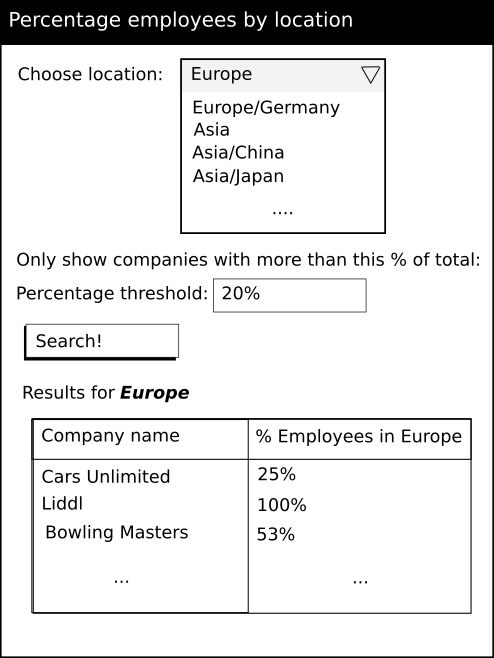
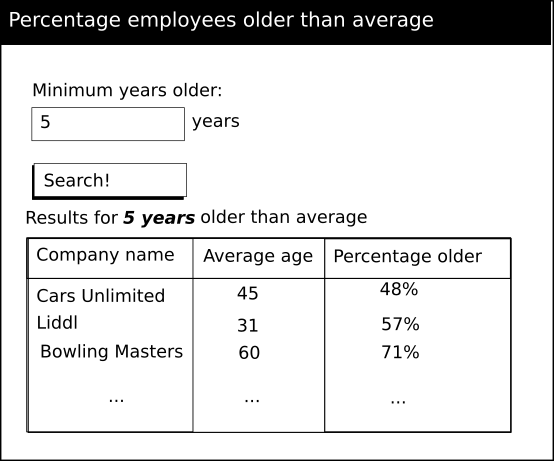
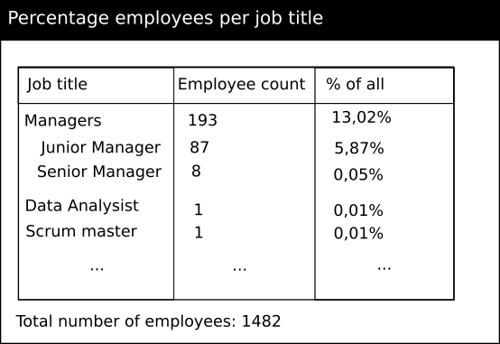

# Advanced Exercice for Crunchr Senior Developper #

## Problem Description ##

A client owns many companies with employees located over several locations.
The client wants to be able to view various statistics about his companies and their employees over the different locations.

The goal of this exercice is to create a small website.
The website does not need to look pretty or be styled exactly like the designs.
You're also free to choose how you would like to structure the application and
how to make the front-end and back-end communicate.
The most important thing is that your code is readable, maintainable, scalable, well structured, etcetera.

You will see that each exercise is separated into an **static** and **dynamic** task.
We expect from you to be able to perform all the **static** tasks, and at least one of the
**dynamic** tasks.
Since we don't want you to spend more than 8 hours on this exercice, it is OK if you can't make
the whole website. We don't expect you to be able to do so!!!

Please, mark down also how much time you spend on the whole problem as an indication for us.

Good Luck!!

## The dataset ##

The dataset you received from the client  has 6 columns:

 - First Name
 - Last Name
 - Age
 - Job title
 - Company name
 - Location

## Exercises ##

### Statistics over the location ###

Here the client would like to be able to have a list of all the companies which have N% employees on a given location.

**Static**
At first, you should try to make this a static page with queries all the companies which have at least 80% employees in Europe.

**Dynamic**
If this goes well, you shall give the user the possibility to enter the percentage he desires, and select the location.

The client gave you percentage_location.png as a design document for this page.

### Statistics over the age ###

The client is very concerned by the average age of the employees of his companies.
**Static**
He wants a page which show all the average age of the employees per company.

**Dynamic**
But ideally, he'd  like to have a list of all the employees per company which are N years older than the average.
N being any number the user can give in.

He gave you older-than-average.png as a design document.

### Statistics over the job title ###

The job title list the client gave you was not properly compiled.
Every company had its own way of filling in the job title, and some didn't go through spell-check.
The client would like to know the percentage of every unique job title for all the companies he owns combined.

**Static**
The first step of this task is to list per unique job title the corresponding occurence.

**Dynamic**
The job titles can be sorted under groups.
For instance, the group **Manager** can contain "Junior Manager", "Senior Manager", "Sales Manager"...
Add an option to list per title group the corresponding occurence.
You are free to choose how to group the job titles, as there are more than one grouping possible.

(Note that you're free to decide on your own groupings, or to not group at all.)

### Optional ###

The client would like to be able in the future to upload himself the data, via a separate upload page.
You don't have to make this page, but keep in mind that the client would like to have at one point.

